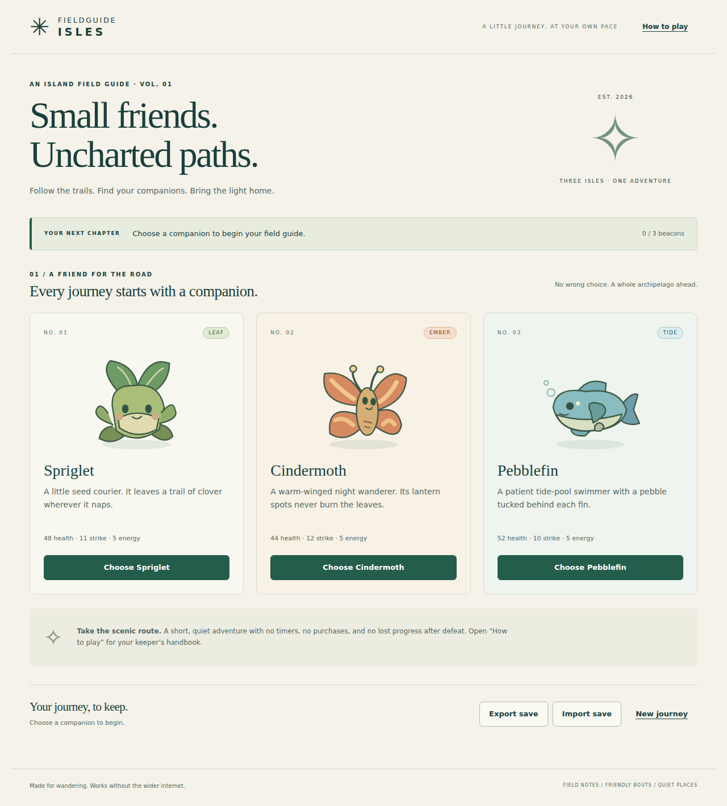

# Fieldguide Isles

An offline creature-adventure browser game: choose a companion, explore three connected islands, befriend a party, relight three beacons, and guide the great Bellray home. Six original species, locally bundled vector artwork, deterministic turn-based battles, safe defeat recovery, and portable JSON saves.



## Play locally

Install Node.js 22 or newer, then from this directory run:

```sh
npm start
```

Open **http://127.0.0.1:4173** in a modern browser. No `npm install`, build step, account, or external internet connection is needed to play. The server binds only to loopback and serves only the bundled runtime. Stop it with Ctrl+C. Set `PORT=4174` to choose another port. Keep the server running while playing; “offline” means no wider internet, not that the local server can be stopped. Direct `file://` opening is unsupported because browser JavaScript modules need an HTTP origin.

Choose a starter, then select connected places on the illustrated map. Open **How to play** for the full tutorial. Use Tab / Shift+Tab to navigate and Enter or Space to activate controls; touch and mouse also work. The objective bar tracks the next required step. Rest at shelters for free. Friendship is guaranteed when an ordinary creature has half health or less. Your party holds three; additional friends stay in reserve. Defeat loses no discoveries or beacon unlocks.

The game saves after each action when browser storage is available. Use **Export save** for backups or transfer to another browser, then **Import save** there. Invalid files do not replace progress. If device storage is unavailable, the game explicitly tells you to export before leaving. See [save format and limitations](docs/saves.md).

## Verify

The engine tests use Node's built-in runner and need no installed packages:

```sh
npm test
```

Browser verification requires the pinned development dependencies and Chromium. Installing them once needs internet; running the game or the tests afterward does not:

```sh
npm ci --cache /tmp/fieldguide-npm-cache
PLAYWRIGHT_BROWSERS_PATH=/tmp/fieldguide-browsers npx --cache /tmp/fieldguide-npm-cache playwright install chromium
PLAYWRIGHT_BROWSERS_PATH=/tmp/fieldguide-browsers npm run verify
```

On Linux, Chromium also requires the usual browser system libraries. They are available in the environment used for the recorded checks; this project does not install system packages. If using your standard Playwright browser cache instead, omit `PLAYWRIGHT_BROWSERS_PATH` from both install and test commands.

`npm test` checks battle arithmetic, progression, save validation, recovery, reserve management, 300 winning campaigns (three starters × seeds 1–100), replay hashes, and 14,000 seeded state-machine steps. `npm run test:browser` launches its own temporary loopback server and exercises campaigns through actual controls in Chromium with all external requests blocked. It rewrites the browser measurements and screenshots in `results/`; timings may vary. `npm run audit:tree` checks artifact limits and writes the current size inventory. No production build is necessary: the source modules are the runtime.

Read [verification evidence](docs/verification.md), [rules and design](docs/design.md), and [asset provenance](docs/assets.md). Replay fixtures are checked, not regenerated, during tests. Regenerate intentionally with `node scripts/campaigns.mjs` only after reviewing a rules change.

## Project layout

- `src/engine.js`: pure deterministic state transitions, independent of the browser.
- `src/data.js`: species, connected map, and authored story.
- `src/saves.js`: bounded strict save validation and storage adapters.
- `src/app.js`, `style.css`, `index.html`: accessible native controls and responsive interface.
- `assets/`: eight original SVG assets.
- `tests/`: engine, save, seeded campaign, and Chromium checks.
- `results/`: actual replay hashes, browser observations, screenshots, and test output.

This is a complete small campaign, not an open-ended RPG. There is no audio, leveling, multiplayer, cloud service, or postgame exploration. Human playtesting, screen-reader evaluation, Safari/Firefox testing, and physical mobile-device testing have not been performed. No website has been deployed. Existing genre precedents are documented; no novelty claim is made.
